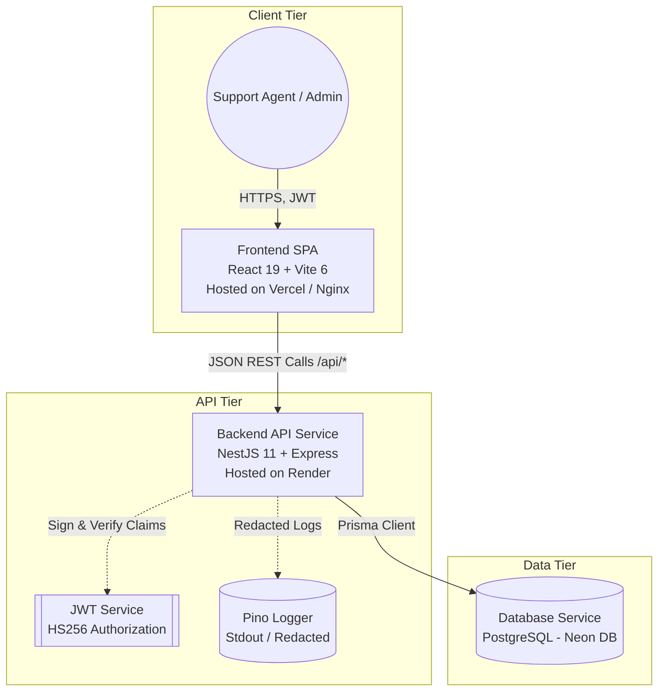
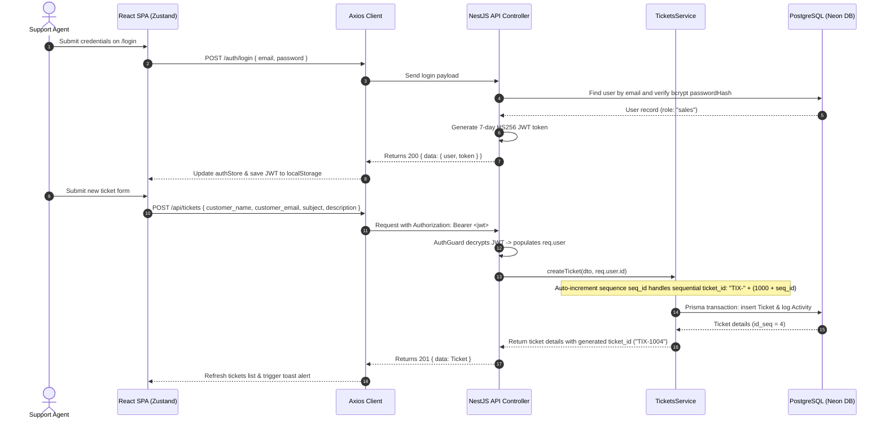
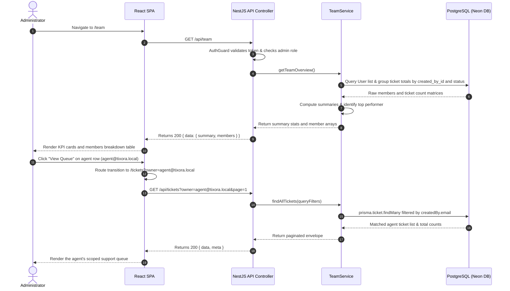
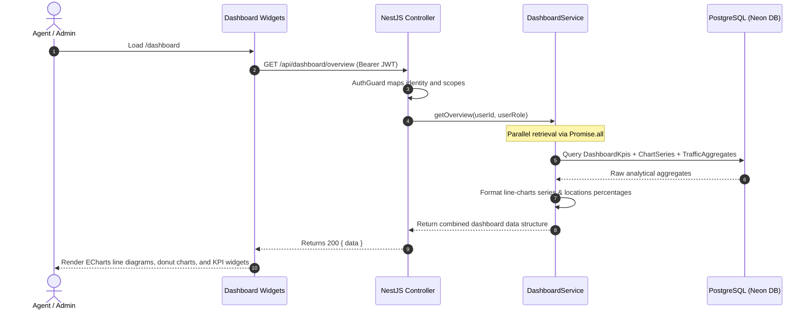
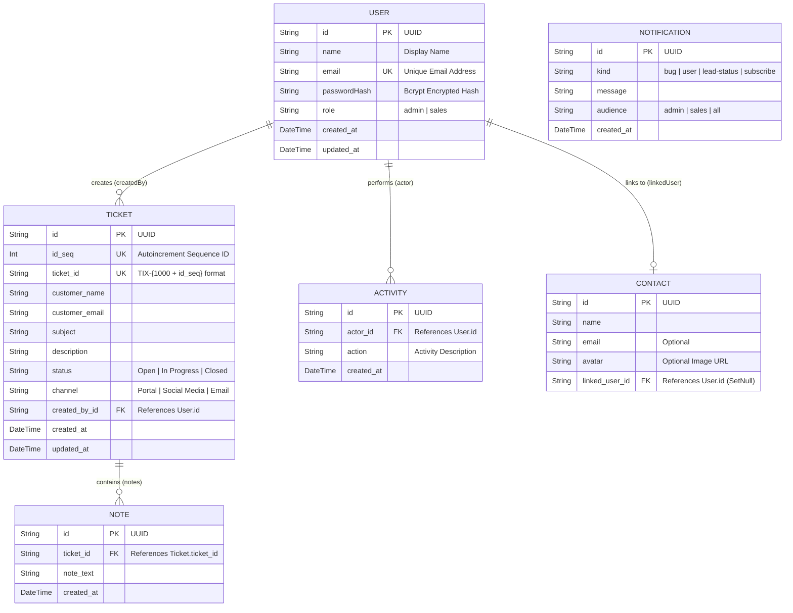

# Tixora System Architecture & Design

This document details the system design, request execution pipelines, workflow sequences, database models, and architectural decisions governing the **Tixora Customer Support CRM**.

---

## 1. System Context

Tixora is built using a monorepo workspace containing a NestJS backend API, a React 19 frontend single-page application (SPA), and a PostgreSQL database.



In a local environment, the services are run either directly via workspaces tooling (`pnpm dev`) or orchestrated inside Docker Compose (`web`, `api`, `db`). In production, they are distributed across Vercel (frontend), Render (backend container runtime), and Neon DB (serverless managed PostgreSQL).

---

## 2. API Request Lifecycle

Every incoming HTTP request to the NestJS API passes through a strict execution pipeline before returning a standardized JSON envelope.

```mermaid
flowchart TD
  req([Incoming HTTP Request]) --> cors[CORS Middleware<br/>Origin verification]
  cors --> helmet[Helmet Middleware<br/>Security headers]
  helmet --> comp[Compression Middleware<br/>Gzip compression]
  comp --> auth[AuthGuard<br/>JWT decryption & claim mapping]
  auth --> role[AdminGuard / Roles check<br/>Optional RBAC validation]
  role --> pipes[ValidationPipe<br/>class-validator DTO sanitization]
  pipes --> controller[Controller Layer<br/>Route mapping & query parsing]
  controller --> svc[Service Layer<br/>Core business logic]
  svc --> db[(Prisma Client / PostgreSQL)]
  db --> svc
  svc --> controller
  controller --> res([Standard JSON Envelope<br/>{ data, meta? }])

  %% Error Boundary Handling
  controller -.->|Throws HttpException| filter[HttpExceptionFilter<br/>Global Exception Mapper]
  svc -.->|Throws AppExceptions| filter
  pipes -.->|Validation Failed| filter
  filter --> errRes([Standard Error Envelope<br/>{ error }])
```

### Request Pipeline Components:

1. **Middlewares**: CORS rules, Helmet security headers, and gzip compression are mounted globally in [`main.ts`](file:///c:/SharedData/Downloads/Tixora/Backend/src/main.ts).
2. **AuthGuard**: Extracts the `Authorization` header, decrypts the Bearer JWT token using `JwtService`, validates the expiration, and populates `req.user` with the agent's identity.
3. **Roles Check**: Enforces role constraints (`admin` or `sales`) on restricted routes (like `/api/team`).
4. **ValidationPipe**: Automatically validates and sanitizes incoming body payloads and query parameters using DTO definitions.
5. **HttpExceptionFilter**: Intercepts all bubbled errors and maps them to a unified format:
   ```json
   {
     "error": {
       "code": "VALIDATION_ERROR",
       "message": "Input validation failed",
       "details": ["customer_email must be a valid email"]
     }
   }
   ```

---

## 3. Core Workflow Sequences

### 3.1. Agent Authentication and Ticket Creation

This diagram details the flow from initial agent login to creating a new ticket with automatic sequential ID assignment (`TIX-XXXX`).



---

### 3.2. Admin Overview and Member Ticket Drill-Down

Admins have visibility over all agents' performance metrics and can inspect any individual queue.



---

### 3.3. Dashboard Widgets Read Pipeline

The dashboard reads KPI summaries, time-series charts, and traffic aggregates in a single optimized endpoint.



---

## 4. Entity-Relationship Database Layout

Tixora's relational schema is modeled in PostgreSQL using Prisma ORM.



### Database Design Points:

- **Autoincrement Sequential ID**: `Ticket.id_seq` utilizes PostgreSQL sequence generators to safely yield continuous sequential numeric values.
- **Cascading Deletions**: Deleting a `User` cascades to delete associated `Ticket` and `Activity` records. Deleting a `Ticket` cascades to wipe its associated internal `Note` records.
- **Nullable User Links**: Deleting a `User` does not delete a `Contact` card; the connection is safely set to null (`onDelete: SetNull`).

---

## 5. Architectural Considerations and Trade-offs

### 5.1. Monorepo Organization

We maintain a monorepo structure managed through `pnpm` workspaces (detailed in [ADR 0006](docs/ADRs/0006-pnpm-workspaces.md)). This architecture allows shared type structures, simplified repository management, and synchronized build steps under one central `pnpm-lock.yaml`.

### 5.2. Client-Side JWT Storage

Authentications are logged using Bearer JWT tokens stored in `localStorage` on the client (detailed in [ADR 0005](docs/ADRs/0005-token-in-localstorage.md)). While highly compatible with static hosting architectures (like Vercel), it introduces XSS vulnerability risks. Moving to an `httpOnly` secure cookie structure remains a primary roadmap objective.

### 5.3. Relational Autoincrement sequence formats

Generating ticket numbers using a custom Postgres sequence (`TIX-${1000 + id_seq}`) guarantees that ticket IDs are short, guessable, and user-friendly. A transactional schema ensures no ID sequence skips occur during high-concurrency ticket submissions.

### 5.4. In-Memory Rate Limiting

NestJS routes rate-limit limits are calculated in-memory on the application runtime instance. While simple and sufficient for standalone container deploys, it requires migrating to Redis-backed limiters when deploying multiple horizontal backend instances.
