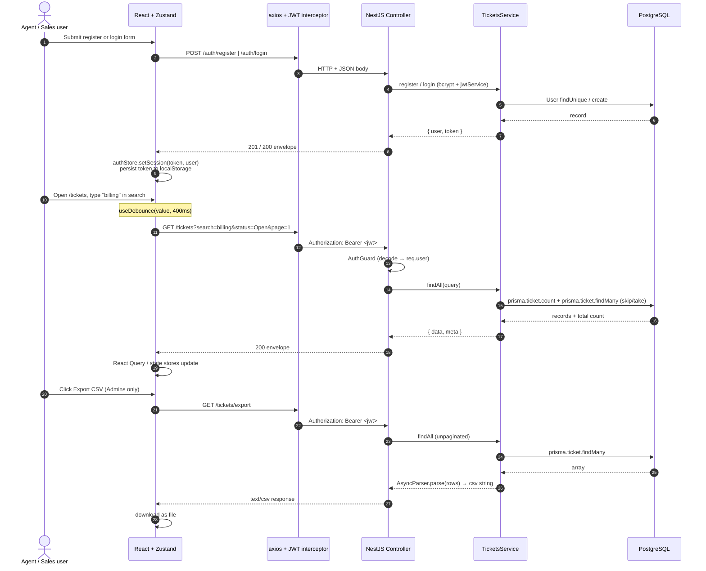
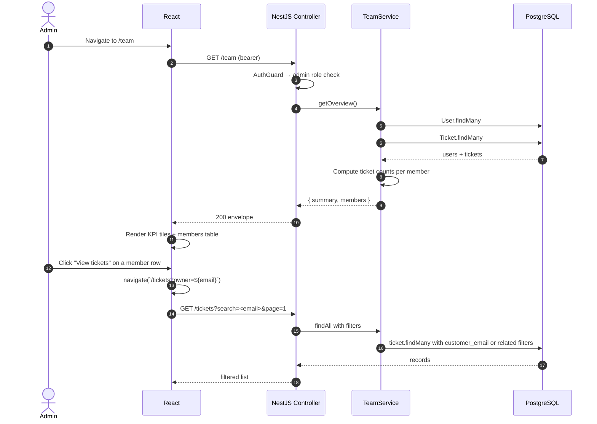
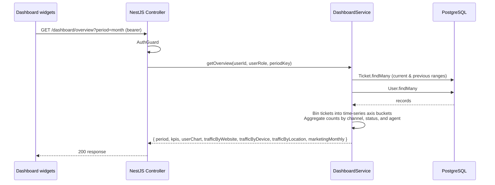
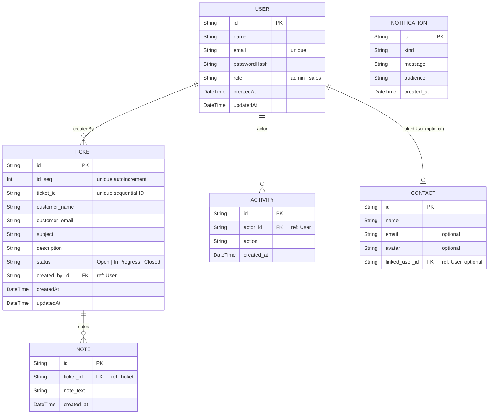

# Architecture

How Tixora is wired together. Reading order: system context → request pipeline → primary-workflow sequence → data model → known limitations.

## System context

```mermaid
flowchart LR
  user((User))
  user -->|HTTPS, bearer JWT| web[Frontend<br/>React + Vite, Vercel or nginx]
  web -->|JSON over /api/*| api[Backend<br/>NestJS + TypeScript, Render]
  api -->|Prisma Client| db[(PostgreSQL - Neon DB)]
  api -.->|stdout| logs[(structured logging)]
  api -->|signs / verifies| jwt[[JWT HS256 + JWT_SECRET]]
flowchart
```

Three runtime services in the local Docker compose stack (`web`, `api`, `db`); production splits them across **Vercel** (web), **Render** (api), and **Neon DB** (db). Frontend talks to backend only through `/api/*` — in production via the configured `VITE_API_URL`.

## Request pipeline (API)

```mermaid
flowchart TB
  req([Incoming request])
  req --> cors[CORS middleware<br/>env.CORS_ORIGIN comma-split]
  cors --> auth[AuthGuard<br/>JWT verify → req.user]
  auth --> role[AdminRoute check<br/>optional admin layer]
  role --> controller[Controller DTO Validation<br/>class-validator / DTOs]
  controller --> svc[Service — business logic]
  svc --> db[(Prisma Client / PostgreSQL)]
  svc --> controller
  controller --> res([JSON envelope])
  controller -.->|throws NestJS HttpException| err[HttpExceptionFilter<br/>exception filter]
  err --> res
flowchart
```

Mounting order is handled via NestJS's standard execution pipeline: Guards → Interceptors → Pipes (Validation) → Route Handlers → Exception Filters.

Errors bubble up to the global `HttpExceptionFilter` which maps errors to a structured `{ error: { code, message, details? } }` envelope.

## Primary workflow — Agent creates and filters tickets



Every authenticated request shares the same guard validation: `AuthGuard` first, then route handlers. Role-based ownership checks live in the service layer for tickets (agents only see/touch their own; admins see all).

## Admin workflow — Team page + per-user drill-in



## Dashboard read-API workflow

The dashboard KPIs, time-series charts, website traffic breakdown, and monthly volume are fully computed dynamically at runtime from database queries on `Ticket`, `User`, `Note`, and `Activity`.



---

## Data model

The database schema is defined in [schema.prisma](Backend/prisma/schema.prisma) and maps the following core tables:



---

## Known limitations & considerations

- **Type drift** between Backend and Frontend interfaces. Mitigated by CI lint+typecheck on both sides. pnpm workspaces are in place (see [ADR 0006](docs/ADRs/0006-pnpm-workspaces.md)).
- **Token in localStorage** is XSS-exposed. CSP and httpOnly-cookie migration are in the roadmap.
- **No refresh tokens**. The access token simply expires after `JWT_EXPIRES_IN`; the user re-logs in.
- **CSV export is array-based** (`Ticket.findMany()`). Bounded by available heap.
- **In-memory rate limiter**. Multi-dyno deployments need a shared store (`rate-limit-redis`).
- **No observability** (Sentry/OTel). Logs are stdout only.
