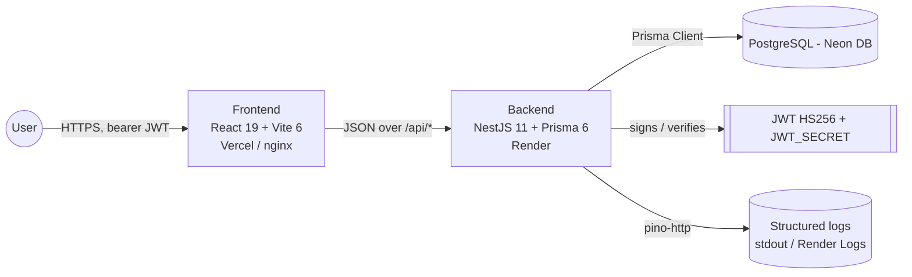

<!-- markdownlint-disable MD013 MD033 -->

# Tixora - Smart Customer Support CRM

A modern, high-performance customer support ticket management CRM. Tixora features role-based access control, a secure service-layer security boundary, server-side composed filtering, real-time activity tracking, internal notes, and rich analytics dashboards.

[](#tech-stack)
[](#tech-stack)
[](#tech-stack)
[](#tech-stack)
[](#tech-stack)
[](#tech-stack)
[](#tech-stack)
[](#tech-stack)
[](LICENSE)
[](#roadmap)

## Overview

Tixora is a production-hardened Support CRM MVP built with NestJS and React 19. System agents manage support tickets in a role-scoped, paginated pipeline. Admins oversee performance via a dedicated Team view with member activity drill-downs and dashboard metrics. Built as a monorepo under `pnpm` workspaces, it features deep server-side query filters (`?status&search&owner&sort&page`), sequential ticket ID generation (`TIX-1001`), database-aware health checks, and responsive design layouts.

## Problem Statement

Standard customer support dashboard templates usually lack robust ownership semantics, secure server-side pagination, strict API authorization boundaries, and relational consistency. Tixora resolves this by providing a unified monorepo architecture where NestJS acts as the strict business logic and validation layer, Prisma ORM maintains referential integrity on PostgreSQL, and the React frontend consumes a typed API via Axios and TanStack Query. It manages full-text searches, compound query composition, and secure role boundaries (where sales agents only view their own tickets, while admins oversee the entire team queue).

## Live Demo

| Item                | Link                                              |
| ------------------- | ------------------------------------------------- |
| Frontend (Vercel)   | <https://tixora-orcin.vercel.app>                 |
| API root (Render)   | <https://tixora-api-z8kk.onrender.com>            |
| API health (Render) | <https://tixora-api-z8kk.onrender.com/api/health> |
| Source              | <https://github.com/aaditya09750/Tixora>          |

### Try it — Seeded Credentials

Log in at <https://tixora-orcin.vercel.app/login> using any of the following accounts:

| Role  | Email                      | Password      | What you'll see                                          |
| ----- | -------------------------- | ------------- | -------------------------------------------------------- |
| admin | `admin@tixora.local`       | `admin123!`   | All tickets, the **Team** page, and unrestricted filters |
| sales | `sales@tixora.local`       | `sales123!`   | Scoped queue (own tickets only), no Team page access     |
| sales | `aadigunjal0975@gmail.com` | `aaditya123!` | Scoped queue (own tickets only), same sales-level access |

> **Note on Cold Starts** — Render's free tier spins down services after 15 minutes of inactivity. The first API request may take ~30 seconds to wake up the service; subsequent requests will respond instantly. If your initial login hangs, wait 30 seconds and retry.

## Core Features

### Sales Agents

- **Ticket Management**: Create support tickets with fields for Customer Name, Email, Subject, and Description.
- **Workflow Statuses**: Move tickets through `Open` → `In Progress` → `Closed` stages.
- **Internal Comments**: Log notes and comments to tickets for team sharing and status tracking.
- **Rich Filtering & Search**: Compose queries with status, owner, sorting, and full-text search, all paginated server-side (10 items per page).
- **Interactive Dashboard**: Track ticket KPIs, channel distribution, and monthly volumes via ECharts widgets.
- **Responsive Layouts**: Collapsible table-to-card items for tablet/mobile screen widths (`<768px`).

### Admins

- **Unrestricted Queue Access**: Search, view, update, and manage all support tickets across the entire organization.
- **Team Page**: Real-time listing of active agents with ticket totals (Open, In Progress, Closed) and quick-action drill-ins to inspect any agent's active queue.
- **Admin Guarding**: Access controls guarded at the route level via client-side routers and enforced strictly at the API layer with NestJS Guards.

### Platform Architecture

- **Secure Authentication**: JWT token authentication (HS256) with `JWT_SECRET` length (≥ 32 characters) validated at startup.
- **API Validation & Errors**: DTO validation using NestJS pipes and class-validator, yielding unified error structures: `{ error: { code, message, details? } }`.
- **Structured Logging**: Pino-based request logging with automated header redaction (Authorization, Cookies).
- **Database Resiliency**: Prisma-driven schema migration, seeding, and database-aware `/api/health` probes (returns `503 Service Unavailable` if PostgreSQL is disconnected).
- **Performance Enhancements**: Gzip compression, Helmet headers, CORS origins configuration, and rate-limiting.

## Tech Stack

| Layer        | Tech             | Version    | Purpose                                                    |
| ------------ | ---------------- | ---------- | ---------------------------------------------------------- |
| **Frontend** | React            | 19.1.x     | View rendering and state updates                           |
| **Frontend** | Vite             | 6.x        | Bundle manager and development server                      |
| **Frontend** | TypeScript       | 5.8.x      | Strict type definitions across the SPA                     |
| **Frontend** | Tailwind CSS     | 3.4.x      | Utility-first styling with variable-based theming          |
| **Frontend** | React Router     | 7.x        | Single Page Application layout and route guarding          |
| **Frontend** | Zustand          | 5.x        | Client state stores (`authStore`, `themeStore`, `uiStore`) |
| **Frontend** | TanStack Query   | 5.x        | Server-state caching and automatic validation              |
| **Frontend** | React Hook Form  | 7.x        | Validated forms control                                    |
| **Frontend** | ECharts          | 6.x        | Interactive analytics charts (donut, line, bar)            |
| **Frontend** | Axios            | 1.x        | API clients with interceptors for bearer JWTs              |
| **Frontend** | Sonner           | 2.x        | Elegant toast messaging notifications                      |
| **Backend**  | NestJS           | 11.x       | Backend modular server framework                           |
| **Backend**  | TypeScript       | 5.7.x      | Type checking in NestJS modules                            |
| **Backend**  | Prisma ORM       | 6.2.x      | PostgreSQL relational mapping and database query builder   |
| **Backend**  | bcryptjs         | 2.x        | Portability-friendly password hashing                      |
| **Backend**  | jsonwebtoken     | 9.x        | HS256 JWT utility signing and parsing                      |
| **Backend**  | express          | 5.x        | Core HTTP platform layer underneath NestJS                 |
| **Backend**  | Helmet           | 8.x        | Basic HTTP security headers                                |
| **Backend**  | compression      | 1.x        | gzip response compression                                  |
| **Backend**  | pino / pino-http | 9.x / 10.x | Redacted structured logging                                |
| **Database** | PostgreSQL       | 16 / Neon  | Relational storage database                                |
| **Tooling**  | pnpm             | 10.30.0    | Workspace package manager with root lockfile               |
| **Tooling**  | Husky            | 9.x        | Pre-commit / pre-push Git hooks                            |
| **Tooling**  | Commitlint       | 19.x       | Conventional Commit validation                             |
| **Tooling**  | ESLint           | 9.x        | Code linting configurations                                |

## Architecture at a Glance



For a detailed breakdown of controllers, request filters, sequence diagrams, and the entity-relationship database layout, refer to the [ARCHITECTURE.md](ARCHITECTURE.md) guide.

## Quick Start

### Prerequisites

- Node.js 22+ (configured via [`.nvmrc`](file:///c:/SharedData/Downloads/Tixora/.nvmrc))
- pnpm 10+ (`corepack enable && corepack prepare pnpm@latest --activate`)
- A PostgreSQL instance (either local or cloud-hosted Neon DB)
- Docker Desktop (optional, for running with Docker Compose)

### Option A — Local Terminals (No Docker)

```bash
# 1. Clone the project and install all dependencies (workspace root)
pnpm install

# 2. Configure Backend Env (terminal 1)
cp Backend/.env.example Backend/.env
# Update Backend/.env with your DATABASE_URL and JWT_SECRET

# 3. Generate Prisma client & sync schema
pnpm --filter ./Backend build
npx prisma db push --schema=Backend/prisma/schema.prisma

# 4. Seed the database with mock tickets and users
pnpm --filter ./Backend seed

# 5. Run the dev servers
pnpm --filter ./Backend dev

# 6. Configure Frontend Env & Run (terminal 2)
cp Frontend/.env.example Frontend/.env
pnpm --filter ./Frontend dev
```

URLs:

- Frontend: <http://localhost:3000>
- API Health: <http://localhost:4000/api/health>

### Option B — Docker Compose

```bash
cp .env.example .env
# Set JWT_SECRET (min 32 chars) in .env
docker compose up --build
```

Then seed the database once the container has started:

```bash
docker compose exec api node dist/seed.js
```

URLs:

- Frontend: <http://localhost:8080>
- Backend: <http://localhost:4000/api/health>

## Environment Variables

### Backend (`Backend/.env`)

| Variable         | Required | Default                 | Source                                 | Purpose                                                 |
| ---------------- | -------- | ----------------------- | -------------------------------------- | ------------------------------------------------------- |
| `DATABASE_URL`   | Yes      | —                       | [env.ts](Backend/src/config/env.ts)    | PostgreSQL URI including connection details             |
| `JWT_SECRET`     | Yes      | —                       | [env.ts](Backend/src/config/env.ts)    | HS256 secret key (**must be ≥ 32 characters**)          |
| `JWT_EXPIRES_IN` | No       | `7d`                    | [env.ts](Backend/src/config/env.ts)    | Access token lifetime before expiry                     |
| `CORS_ORIGIN`    | No       | `http://localhost:3000` | [main.ts](Backend/src/main.ts)         | Origin allowlist for incoming CORS requests             |
| `PORT`           | No       | `4000`                  | [main.ts](Backend/src/main.ts)         | Web server port number                                  |
| `LOG_LEVEL`      | No       | `info`                  | [logger.ts](Backend/src/lib/logger.ts) | Pinot logger verbosity level (`error`, `info`, `trace`) |
| `BCRYPT_ROUNDS`  | No       | `10`                    | [env.ts](Backend/src/config/env.ts)    | Encryption hashing rounds                               |
| `NODE_ENV`       | No       | `development`           | —                                      | Target environment (`development`, `production`)        |

### Frontend (`Frontend/.env`)

| Variable       | Required | Default | Source                            | Purpose                                                       |
| -------------- | -------- | ------- | --------------------------------- | ------------------------------------------------------------- |
| `VITE_API_URL` | Yes      | —       | [env.ts](Frontend/src/lib/env.ts) | Target NestJS API base path, e.g. `http://localhost:4000/api` |

### Docker Compose host ports (root `.env`)

| Variable   | Default | Purpose                                      |
| ---------- | ------- | -------------------------------------------- |
| `WEB_PORT` | `8080`  | Client distribution endpoint hosted on Nginx |
| `API_PORT` | `4000`  | Backend API port endpoint                    |
| `DB_PORT`  | `5432`  | Postgres relational container port           |

## Available Scripts

### Workspace Root Tooling

| Script              | Purpose                                                                |
| ------------------- | ---------------------------------------------------------------------- |
| `pnpm install`      | Installs dependencies across both packages (workspace-aware)           |
| `pnpm format`       | Formats project `.md`, `.json`, `.yaml`, and `.yml` files via Prettier |
| `pnpm format:check` | Verifies formatting rules without editing files                        |

### Backend (`Backend/`)

| Script           | Purpose                                                          |
| ---------------- | ---------------------------------------------------------------- |
| `pnpm dev`       | Runs tsx dev watch server on `:4000`                             |
| `pnpm build`     | Triggers Prisma generate and compiles TypeScript code to `dist/` |
| `pnpm start`     | Launches built NestJS bundle (`node dist/main.js`)               |
| `pnpm seed`      | Generates 3 mock users, 25 tickets, and dashboard widgets data   |
| `pnpm typecheck` | Validates TypeScript compliance (`tsc --noEmit`)                 |
| `pnpm lint`      | Validates lint issues via ESLint flat configs                    |

### Frontend (`Frontend/`)

| Script           | Purpose                                                                |
| ---------------- | ---------------------------------------------------------------------- |
| `pnpm dev`       | Starts Vite hot-reload server on `:3000`                               |
| `pnpm build`     | Compiles client assets to production bundle in `dist/`                 |
| `pnpm preview`   | Launches preview server of built client assets                         |
| `pnpm typecheck` | Validates TypeScript compilation (`tsc -p tsconfig.app.json --noEmit`) |
| `pnpm lint`      | Scans files for styles and lint errors using ESLint rules              |

## Quality Tooling

| Tool                   | Purpose                                                                                |
| ---------------------- | -------------------------------------------------------------------------------------- |
| **ESLint Flat Config** | Style scanning tailored for Node (Backend) and React (Frontend)                        |
| **Prettier**           | Code formatter checking formatting on all markdown, configuration, and JSON files      |
| **Husky**              | Git hook driver enforcing checks on commit hooks                                       |
| **lint-staged**        | Performs Prettier formatting and ESLint fix routines solely on files staged for commit |
| **Commitlint**         | Restricts commit message subject formats to Conventional Commits standard              |

Commit hooks behavior:

- **`pre-commit`**: Executes `lint-staged` against staged files.
- **`commit-msg`**: Scans commit message syntax matching `type(scope): message`.
- **`pre-push`**: Runs linting, type-checking, and build validations across both workspaces.

## Project Structure

```text
Tixora/
├─ Backend/
│  ├─ prisma/             Prisma schema.prisma mapping database tables
│  ├─ src/
│  │  ├─ activity/        Activity modules tracking system operations
│  │  ├─ auth/            Login, signup and passport-like JWT routines
│  │  ├─ config/          Zod-validated env validation schemas
│  │  ├─ contact/         Support contact modules
│  │  ├─ dashboard/       KPI metrics computations and chart widgets
│  │  ├─ health/          Database-aware health indicators
│  │  ├─ lib/             Logger settings and global filters
│  │  ├─ notification/    System-wide notifications
│  │  ├─ prisma/          Injectable Prisma DB connection instance
│  │  ├─ team/            Admin team summary modules
│  │  ├─ tickets/         Support tickets logic (notes, filters)
│  │  ├─ types/           Custom typescript declarations
│  │  ├─ app.module.ts    Root NestJS module
│  │  ├─ seed.ts          Idempotent database seeder
│  │  └─ main.ts          Application bootstrapper
│  ├─ Dockerfile          Multi-stage, node Alpine runner
│  └─ .env.example
├─ Frontend/
│  ├─ src/
│  │  ├─ api/             REST endpoints connectors for tickets, team, auth, dashboard
│  │  ├─ components/      Global layout, UI elements, and dialogs
│  │  ├─ data/            Fallback data variables
│  │  ├─ hooks/           Common hooks (useDebounce, theme indicators)
│  │  ├─ lib/             Axios interceptors, theme utilities, queries setup
│  │  ├─ pages/           Tickets, Team, Dashboard, and Login Pages
│  │  ├─ routes/          App route switches (ProtectedRoute / AdminRoute guards)
│  │  ├─ store/           Zustand store selectors (`authStore`, `themeStore`, `uiStore`)
│  │  └─ types/           Frontend state types (api, team, dashboard)
│  ├─ Dockerfile          Vite compilation served on Nginx
│  ├─ nginx.conf          Nginx reverse proxy configurations
│  └─ .env.example
├─ docs/
│  ├─ ADRs/               Architecture Decision Records
│  ├─ API.md              Detailed REST route documentations
│  └─ SETUP.md            Hosting and configuration steps
├─ .husky/                Git pre-commit, commit-msg, pre-push definitions
├─ docker-compose.yml     Multi-service development container environment
├─ render.yaml            Render Blueprint infrastructure mapping file
├─ pnpm-workspace.yaml    Workspaces configurations
├─ pnpm-lock.yaml         Unified workspace dependency lockfile
├─ AGENTS.md              Developer agent guidelines
├─ ARCHITECTURE.md        Design diagrams and data schemas
├─ CONTRIBUTING.md        Onboarding and coding standards
├─ SECURITY.md            Security disclosure protocols
├─ LICENSE                MIT License terms
└─ package.json           Workspace root package file
```

## API Reference Summary

All endpoints are hosted prefixing `/api/*`. Requests requiring authentication require headers containing `Authorization: Bearer <jwt>`.

| Method | Path                  | Auth           | Purpose                                                      |
| ------ | --------------------- | -------------- | ------------------------------------------------------------ |
| `GET`  | `/health`             | Public         | Relational DB-aware health status indicator                  |
| `POST` | `/auth/register`      | Public         | Registers a new agent profile (defaults to `sales`)          |
| `POST` | `/auth/login`         | Public         | Authenticates credentials and returns a Bearer JWT           |
| `GET`  | `/auth/me`            | Bearer         | Resolves currently authenticated agent details               |
| `GET`  | `/tickets`            | Bearer         | Lists tickets (`?status&search&owner&sort&page`)             |
| `POST` | `/tickets`            | Bearer         | Submits a new support ticket in the database                 |
| `GET`  | `/tickets/:ticket_id` | Bearer         | Retrieves a detailed ticket record and internal notes        |
| `PUT`  | `/tickets/:ticket_id` | Bearer         | Updates status and appends internal note messages            |
| `GET`  | `/team`               | Bearer + Admin | Fetches performance statistics across the sales agents team  |
| `GET`  | `/dashboard/overview` | Bearer         | Retrieves KPI widgets, chart aggregates and location details |
| `GET`  | `/activities`         | Bearer         | Resolves list of the 20 most recent system events            |
| `GET`  | `/contacts`           | Bearer         | Fetches alphabetical list of support contacts                |
| `GET`  | `/notifications`      | Bearer         | Resolves notifications matching current user's role          |

For detailed structures, body payloads, parameters, and testing examples, see [docs/API.md](docs/API.md).

## Deployment

Deploying Tixora involves connecting to **Neon DB (PostgreSQL)**, **Render (Backend)**, and **Vercel (Frontend)**.

### 1. Database Provisioning (Neon DB)

1. Sign up on [Neon Tech](https://neon.tech) and create a new project.
2. Under Connection Details, copy the database connection URI.
3. Paste this string as the `DATABASE_URL` env variable in your backend setup.

### 2. Backend Hosting (Render Blueprint)

1. Commit and push your code to your GitHub repository.
2. In your Render Dashboard, click **New** → **Blueprint** and select your repository.
3. Render parses the [`render.yaml`](../render.yaml) file to build the `tixora-api` Docker service.
4. Supply the following environment variables:
   - `DATABASE_URL`: Your Neon database URI string.
   - `CORS_ORIGIN`: Your production Vercel application URL (e.g. `https://tixora-orcin.vercel.app`).
5. Open Render's **Shell** tab on the deployed service and run `pnpm seed` to initialize the database records.

### 3. Frontend Hosting (Vercel)

1. In Vercel, import your repository. Specify `Frontend` as the root directory.
2. Add the environment variable:
   - `VITE_API_URL`: Your Render backend endpoint URL (e.g. `https://tixora-api-z8kk.onrender.com/api`).
3. Deploy the application. Route overrides mapped in `vercel.json` will redirect SPA routes to index.html.
4. Copy the assigned Vercel URL, save it as `CORS_ORIGIN` in Render's env variable dashboard, and redeploy the API service.

## Scalability Considerations

- **Stateless API design**: Authentication is handled strictly through JWT claims. No user sessions are cached on the server, permitting immediate scale-out behind load balancers.
- **Database Index Optimization**: Relational fields (`User.email`, `Ticket.ticket_id`, and `Ticket.created_by_id`) contain indexes inside PostgreSQL to ensure rapid lookups on composed queues.
- **Dashboard Data Model**: The dashboard read API aggregates metrics dynamically via parallel queries (`Promise.all`), optimizing response times for analytical UI graphs.
- **Logger Redactions**: High-verbosity logs omit sensitive elements (like `Authorization` bearer tokens and `Cookie` details) at the logger boundary.

## Roadmap

- **Refresh Token Mechanisms**: Move the current `localStorage` JWT scheme to a more secure `httpOnly` cookie strategy ([ADR 0005](docs/ADRs/0005-token-in-localstorage.md)).
- **Shared Modules Package**: Consolidate shared interfaces and Zod validation definitions into a unified shared workspace module.
- **Automated Tests**: Establish comprehensive suite coverages (Vitest / NestJS tests) on controllers and core services.
- **Observability Pipelines**: Hook Sentry or OpenTelemetry instrumentation into exception filters and logging services.
- **Bundled Vendor Chunking**: Code-split large libraries (like `echarts`) to minimize frontend bundle size.

## Contributing

See [`CONTRIBUTING.md`](CONTRIBUTING.md) for onboarding instructions, git branch structure, formatting rules, and validation checks.

## Security

Please report vulnerabilities privately via the email outlined in [`SECURITY.md`](SECURITY.md).

## License

This software is released under the terms of the [MIT License](LICENSE).

## Acknowledgements

Designed and maintained by **Aaditya Gunjal** as a full-stack support CRM MVP.

- **GitHub**: <https://github.com/aaditya09750>
- **Email**: <aadigunjal0975@gmail.com>
